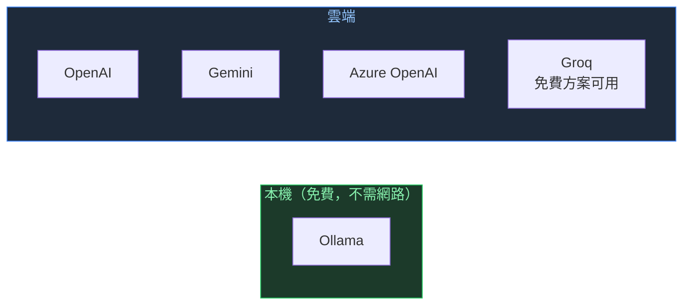
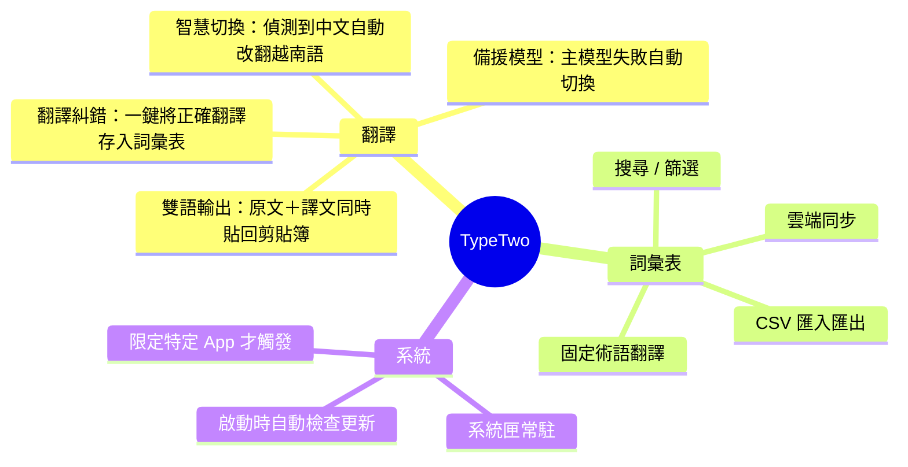
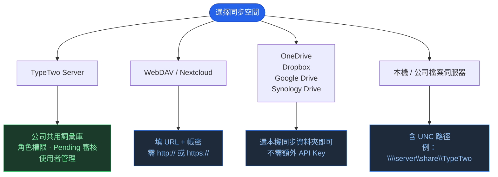

# TypeTwo

> Windows 雙語輸出翻譯工具

---

## 怎麼用


---

## 支援的 AI 引擎



每個 Provider 的 API Key、Endpoint、模型各自獨立儲存，切換時自動還原。

---

## 主要功能



---

## 設定分頁

| 分頁 | 功能 |
|------|------|
| 翻譯引擎 | Provider、API Key、模型、備援模型、測試連線 |
| 語言設定 | 來源語言、目標語言、輸出格式範本 |
| 翻譯規則 | 自訂 Prompt，每行一條 |
| 詞彙表 | 術語對照、搜尋、匯入匯出、同步狀態列 |
| 雲端同步 | 同步空間設定、備份還原、角色管理 |
| 限定程式 | 只在指定 .exe 內觸發 |
| 快捷鍵 | 自訂熱鍵組合 |

---

## 詞彙表雲端同步



多個同步空間可拖曳調整優先順序。每次同步前自動備份，可從清單選擇還原點。

---

## 安裝

從 [GitHub Releases](https://github.com/JaplinChen/TypeTwo/releases/latest) 下載 `setup_typetwo.exe` → 執行 → 從開始選單啟動。

升級安裝時自動關閉舊版再覆蓋，不需手動結束程式。

**使用 Ollama（本機免費）：**

```bat
package\install_ollama_and_model.bat
```

---

## 建置 / 開發

```
typetwo_flutter/   Flutter 主程式（UI、熱鍵、系統匣）
backend/           FastAPI 詞彙表後端
installer/         Inno Setup 腳本
```

```bat
build_all.bat      # 輸出 installer\output\setup_typetwo.exe
```

後端部署請見 [backend/README.md](backend/README.md)　｜　Production runbook 請見 [DEPLOYMENT.md](DEPLOYMENT.md)　｜　發版檢查請見 [RELEASE_CHECKLIST.md](RELEASE_CHECKLIST.md)　｜　完成度審核請見 [COMPLETION_AUDIT.md](COMPLETION_AUDIT.md)　｜　回退手冊請見 [ROLLBACK_RUNBOOK.md](ROLLBACK_RUNBOOK.md)
